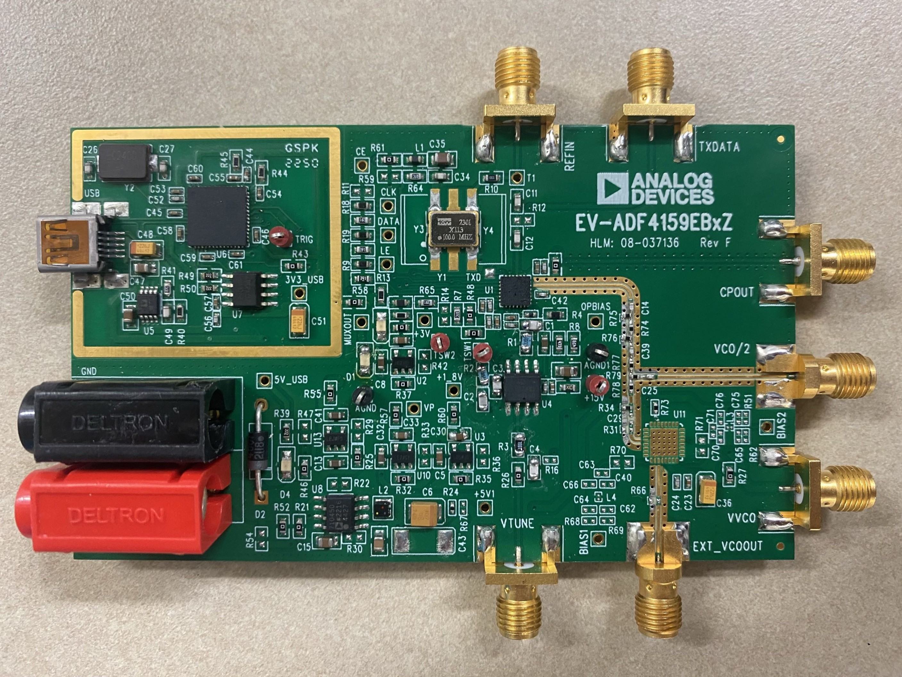

# PICO W Bluetooth Low Energy (BLE) server Controlling Phase-Locked Loop (PLL)
This is a program that sets up the Raspberry Pi Pico W microcontroller to be a BLE server and allows BLE clients (Laptop/PC) to control the Phase Locked Loop (PLL) evaluation board EV-ADF4159EB3Z through a User Interface (Website).

## I. PURPOSE OF THIS REPO
UW Tacoma is designing and fabricating an allegedly first-ever RFIC (an Radio Frequency chip) that can switch between multiple bands. Read more here: [IEEE Article](https://ieeexplore.ieee.org/document/9805676) 

However, to send messages through carrier waves that is generated by its VCO (Voltage Controlled Oscillator), the newly-designed RF chip needs the carrier waves to be firmly locked at designated frequencies. An external PLL (Phase-Locked Loop) takes care of this. Without a PLL, the frequency of the carrier waves jitters and messages are lost.

The Raspberry Pi Pico W will send signals to the PLL and control it, along with the VCO.

## II. OVERVIEW
This project has 3 main components:
1. **BLE Website (User Interface):** Users enter commands for the Pico W here. The commands can be a desired frequency that they want the PLL to lock, turning on Pico W LED, or rebooting the Pico W.

*Note: This BLE Website is developed fully by the awesome Conrad. Since I made some modifications for the BLE Website to harmony with Pico W BLE server, I included the modified version of the user interface in this repo. Check out the original User Interface here:* [Conrad's user interface](https://github.com/SandwichRising/esp32-pll.git)

  <b>Figure 1:</b> The Web BLE interface for connecting to the Pico W and controlling the PLL.

2. **Raspberry Pi Pico W:** Host a BLE server for the BLE Website to connect. Pico W listens to the commands from the Website and directly send serial communication signals (bit banging) to the PLL and control the VCO.

3. **EV-ADF4159EB3Z:** a PLL evaluation board that locks the frequency of an external VCO (Voltage Controlled Oscillator).

  <b>Figure 2:</b> The EV-ADF4159EB3Z evaluation board that contains the PLL ADF4159 chip.

4. **An external VCO:** The source of the carrier waves that needs its frequency lock.

## III. INSTRUCTIONS TO RUN THE PROGRAM
### 1. Hardware Requirements:
- A Laptop with Wifi Connection and Bluetooh available
- A Raspberry Pi Pico W
- A PLL Evaluation board (EV-ADF4159EB3Z or EV-ADF4159EB1Z)
- A VCO (Voltage Controlled Oscillator) that has SMA connection and Vtune. If you're using the EV-ADF4159EB1Z, no need for a VCO because the board has its own.

### 2. Software Requirements:
- Microsoft Visual Studio Code with Raspberry Pi Pico extension installed.
- BLE Website deployed.

### 3. Instructions:
- Install git if you do not have it installed yet
- Open a terminal or PowerShell window and run: git clone https://github.com/Kevpamm/PicoW-PLL-controller.git
- Move into the project folder with command: cd PicoW-PLL-controller
- 